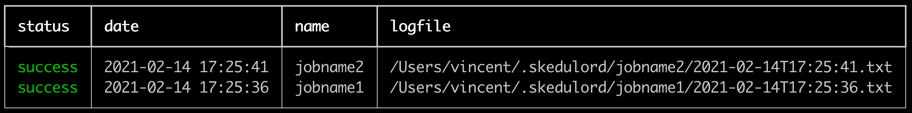

Let's say we've got this small python file. 

```python
# script.py
for i in range(5):
    print(f"i am at iteration {i}")
```

The idea here is that `skedulord` can run this and keep track of logs.

```text
python -m skedulord run jobname1 "python script.py" --retry 3 --wait 60
python -m skedulord run jobname2 "python script.py" --retry 3 --wait 60
```

This will run the `"python script.py"` command as if you'd normally run it
from the command line. The `skedulord` parts around it do some extra things though.

## Logs 

The main thing `skedulord` does is structure logs from your scripts. The logs
are generated in a structured format so it's easy to find bugs. When we ran 
the `skedulord run` command we attached a jobname (aptly named `"jobname"`) which
will also be the name of the folder where logs can be found.

```text
> tree ~/.skedulord/
/Users/vincent/.skedulord/
├── heartbeat.jsonl
├── jobname1
│   ├── 2021-02-14T16:56:34.html
│   └── 2021-02-14T16:56:34.txt
└── jobname2
    ├── 2021-02-14T16:56:35.html
    └── 2021-02-14T16:56:35.txt

```

The logs themselves have a timestamp as the filename. There are basic `.txt` logs 
but also fancy `.html` logs which render nicely in a dashboard.

## Mechanics 

We've designed `skedulord` to also be able to rerun jobs if they fail. Hiccups are
part of real life and sometimes we can make a job succeed by trying again 5 minutes
later. This is why you can specify how many attempts you'd like the job to make by 
setting `--retry`. You can also specify the wait time between attempts via `--wait`. 

## Schedule 

The nice thing about `skedulord` running from the command line is that you can schedule
it via `crontab` too! The downside is that it can get complex. You'd need to ensure that
the jobs have access to the correct virtual environments and this can become a drag. 

To help out, `skedulord` can also configure cron for you by configuring a `.yml` file.

```yaml
# schedule.yml
user: vincent
schedule:
    - name: ping
      command: python /home/vincent/path/scripts/ping.py
      cron: "*/2 * * * *"
    - name: github issues downloader
      command: python /full/path/to/cli.py --repo foobar --output /Users/vincent/data
      cron: "0 1 * * *"
    - name: github actions downloader
      command: python /full/path/to/scrape.py --repo foobar --output /Users/vincent/data
      cron: "0 1 * * *"
```

> Note that it's important to give full paths to files here. 

Given a schedule like this, skedulord can schedule everything via; 

```text
python -m skedulord schedule schedule.yml
```

You can confirm yourself that all jobs are now scheduled to run, with skedulord
taking care of all the logging. 

```text
crontab -e
```

> Note that Unless configured otherwise, skedulord will assume the same virtualenv
as the one that ran the `skedulord schedule` command. This is important to be aware
of if your scripts carry dependencies. 

## Inspection 

Hopefully, your jobs won't fail. But if they do, you'd want to find the logs for the
broken jobs as soon as possible. 

```python
python -m skedulord history
```



This history command has many query parameters that makes it easy for you to find the 
logs of the jobs that failed.

## Dashboard 

If you want, you can even use skedulord to run a small dashboard for you. It's nice and 
minimal as to not to distract you.  

```python
python -m skedulord serve
```


## Shutting Down 

If you're done with the app you can wipe the cronjobs and disk state from the command
line as well. 

```python
# Wipe all the logs from disk. 
python -m skedulord wipe disk --yes --really
# Wipe all the cron entries. 
python -m skedulord wipe cron --yes --really
```