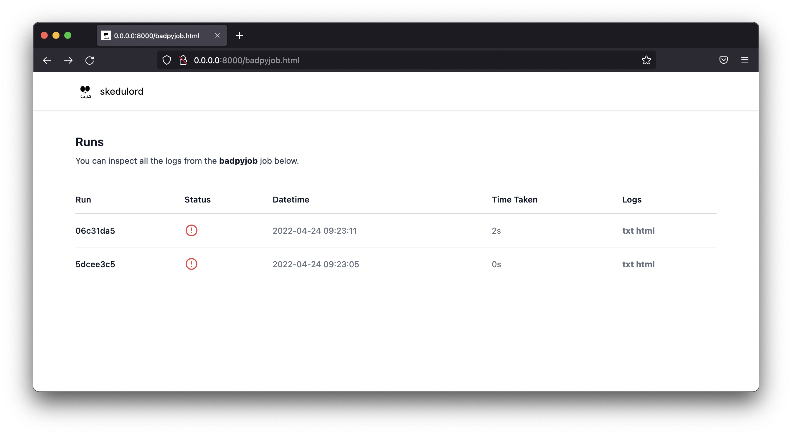

> Skedulord is a tool that automates scheduling and logging of jobs. It's a 
layer on top of cron. It's mainly meant for Python users but it can also be
used for other tools launched from the command line. 

If you're new, check out the [getting started guide](https://koaning.github.io/skedulord/getting-started.html). 

## Installation 

```python
pip install skedulord
```

If you like to live dangerously, you can also install from GitHub for the latest commit. 

```
python -m pip install --upgrade "skedulord @ git+https://github.com/koaning/skedulord.git"
```

## Usage 

These are all the commands available: 

```
> python -m skedulord
Usage: __main__.py [OPTIONS] COMMAND [ARGS]...

  SKEDULORD: helps with cronjobs and logs.

Options:
  --help  Show this message and exit.

Commands:
  schedule  Set (or reset) cron jobs based on config.
  run       Run a single command, which is logged by skedulord.
  history   Shows a table with job status.
  summary   Shows a summary of all jobs.
  build     Builds static html files so you may view a dashboard.
  serve     Opens the dashboard in a browser.
  wipe      Wipe the disk or schedule state.
  version   Show the version.
```

## Docmentation

The docs are hosted on GitHub Pages and can be found [here](koaning.github.io/skedulord/).

## Demo

Let's say we've got this small python file. 

```python
# script.py
for i in range(5):
    print(f"i am at iteration {i}")
```

The idea here is that `skedulord` can run this and keep track of logs.

```text
python -m skedulord run jobname1 "python script.py" --retry 3 --wait 60
python -m skedulord run jobname2 "python script.py" --retry 3 --wait 60
```

This will run the `"python script.py"` command as if you'd normally run it
from the command line. The `skedulord` parts around it do some extra things though.

## Logs 

The main thing `skedulord` does is structure logs from your scripts. The logs
are generated in a structured format so it's easy to find bugs. When we ran 
the `skedulord run` command we attached a jobname (aptly named `"jobname"`) which
will also be the name of the folder where logs can be found.

```text
> tree ~/.skedulord/
/Users/vincent/.skedulord/
├── heartbeat.jsonl
├── jobname1
│   ├── 2021-02-14T16:56:34.html
│   └── 2021-02-14T16:56:34.txt
└── jobname2
    ├── 2021-02-14T16:56:35.html
    └── 2021-02-14T16:56:35.txt

```

The logs themselves have a timestamp as the filename. There are basic `.txt` logs 
but also fancy `.html` logs which render nicely in a dashboard.

## Mechanics 

We've designed `skedulord` to also be able to rerun jobs if they fail. Hiccups are
part of real life and sometimes we can make a job succeed by trying again 5 minutes
later. This is why you can specify how many attempts you'd like the job to make by 
setting `--retry`. You can also specify the wait time between attempts via `--wait`. 

### Schedule 

The nice thing about `skedulord` running from the command line is that you can schedule
it via `crontab` too! The downside is that it can get complex. You'd need to ensure that
the jobs have access to the correct virtual environments and this can become a drag. 

To help out, `skedulord` can also configure cron for you by configuring a `.yml` file.

```yaml
# schedule.yml
user: vincent
schedule:
    - name: ping
      command: python /home/vincent/path/scripts/ping.py
      cron: "*/2 * * * *"
    - name: github issues downloader
      command: python /full/path/to/cli.py --repo foobar --output /Users/vincent/data
      cron: "0 1 * * *"
    - name: github actions downloader
      command: python /full/path/to/scrape.py --repo foobar --output /Users/vincent/data
      cron: "0 1 * * *"
```

Given a schedule like this, skedulord can schedule everything via; 

```text
python -m skedulord schedule schedule.yml
```

You can confirm yourself that all jobs are now scheduled to run, with skedulord
taking care of all the logging. 

```text
crontab -e
```

> Note that when a command starts with `python` skedulord will assume the same virtualenv
as the one that ran the `skedulord schedule` command. You may also pass another Python path
if you prefer to use another virtualenv.

### Dashboard 

If you want, you can even use skedulord to run a small dashboard for you to show
all the logs from past jobs. These are all available from the terminal as well, 
but it's nice to have an extra interface.

```python
python -m skedulord serve
```

The landing page shows an overview of all jobs. 


You can click on the associated link to find all runs.



From here you can explore the logs. We host both the raw .txt logs
and a "fancy" variant that attemps some syntax highlighting.


If you'd like to play around, we host a small demo of this dashboard [here](https://koaning.github.io/skedulord-demo/).
